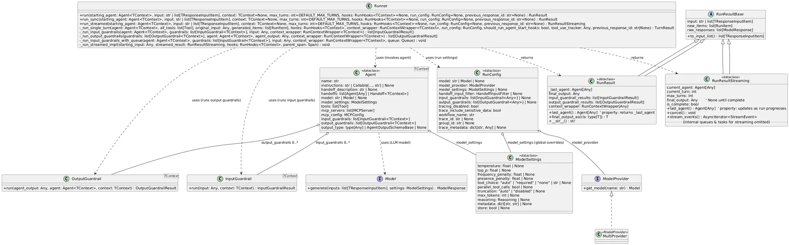

# **Run Lifecycle:**



## 1. Setup & Configuration

1. **You call**
    
    ```python
    runner.run(
      starting_input: str,
      agent: Agent[TContext],
      context: TContext = None,
      max_turns: int = DEFAULT_MAX_TURNS,
      hooks: RunHooks[TContext] = None,
      run_config: RunConfig = None,
      previous_response_id: str = None
    ) -> RunResult
    
    ```
    
2. **RunConfig**
    
    Holds all the “global” settings that control how the agent will run:
    
    - **model_provider**: which LLM(s) to use
    - **model_settings**: temperature, max_tokens, etc.
    - **input_guardrails** & **output_guardrails**: lists of checks/transformers
    - **trace** flags, **workflow_name**, etc.

---

## 2. Input Guardrails

Before giving anything to the agent, we funnel the raw input through zero‑or‑more **InputGuardrail** instances:

```python
run_input_guardrails(agent, guardrails, input, context, context_wrapper)

```

Each guardrail’s

```python
InputGuardrail.run(input: Any, context: TContext) -> InputGuardrailResult

```

can:

- **Validate** (e.g. block disallowed content)
- **Transform** (e.g. sanitize or enrich the text)
- **Enrich** (e.g. look up facts, expand a prompt template)

Only once all guardrails approve do we hand a clean `starting_input` to the agent itself.

---

## 3. Agent Execution Loop

An agent run can involve multiple “turns” (prompt → model call → process → repeat), managed internally by:

> _run(starting_input)
> 
> 
> – kicks off the loop
> 
> **`_run_single_turn(...)`**
> 
> – one iteration of:
> 
> 1. **Decide** what to ask the model next
> 2. **Call** the LLM via the agent’s `model_provider`
>     
>     ```python
>     model = model_provider.get_model(name)
>     response = model.generate(inputs, settings)
>     
>     ```
>     
> 3. **Post‑process** that response (e.g. parse JSON, select a tool, etc.)
- **Agent** (implements your high‑level policy)
    - owns the **instructions** & **tools** list
    - uses the **ModelSettings** from RunConfig
    - calls into the LLM and/or tools to decide its next action
- **ModelProvider**
    - instantiates or reuses LLM clients (e.g. chat vs. embedding models)
- **ModelSettings**
    - per‑turn overrides of temperature, token limits, penalties, etc.
- The loop continues until:
    - a termination criterion is met (e.g. agent returns “DONE”),
    - **`max_turns`** is reached,
    - or an error/hook cancels it.

---

## 4. Output Guardrails & Result

Once the agent signals it’s finished:

1. **Output Guardrails**
    
    Similar to inputs, we pass the **raw agent output** through each
    
    ```python
    OutputGuardrail.run(agent_output, agent, context) -> OutputGuardrailResult
    
    ```
    
    – to enforce format, redact, validate, or enrich the result one last time.
    
2. **Packaging the Result**
    - If you ran synchronously: you get a **`RunResult`** object, containing
        - `last_agent` (the final Agent step)
        - `final_output` (the cleaned answer)
        - `turn_count`, `trace_metadata`, etc.
    - If you streamed: you get a **`RunResultStreaming`** that you can iterate to see partial tokens.

---

## Putting It All Together

```mermaid
flowchart TD
  A[Call runner.run(...)] --> B[Apply InputGuardrails]
  B --> C[Enter Agent Loop (_run)]
  C --> D{Turn < max_turns?}
  D -- yes --> E[Agent decides next prompt]
  E --> F[LLM.generate() via ModelProvider & ModelSettings]
  F --> G[Agent processes response]
  G --> D
  D -- no / DONE --> H[Apply OutputGuardrails]
  H --> I[Return RunResult or RunResultStreaming]

```

1. **runner.run**
2. **InputGuardrails** sanitize/validate
3. **Agent Loop**
    - LLM calls with **ModelSettings**
    - Tools invoked via **Agent.tools**
4. **OutputGuardrails** finalize
5. **RunResult** returned

---

### Key Classes & Their Roles

| Class | Responsibility |
| --- | --- |
| **AgentRunner** | Orchestrates the end‑to‑end lifecycle |
| **RunConfig** | Holds global run settings (models, guardrails, etc.) |
| **Agent** | Encapsulates instructions, tools, and decision logic |
| **ModelProvider** | Supplies configured LLM clients |
| **ModelSettings** | Per‑call parameters (temperature, tokens, etc.) |
| **InputGuardrail** | Pre‑flight checks and transformations on inputs |
| **OutputGuardrail** | Final checks/transformations on generated outputs |
| **RunResult / Streaming** | The structured output you consume |

---